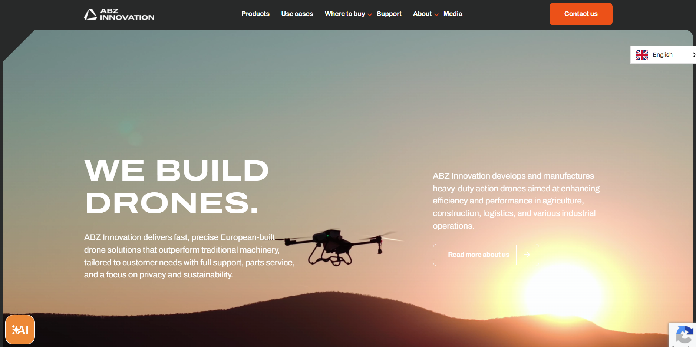

<!-- Cover Image -->

# ABZ Innovation — We Build Drones

ABZ Innovation delivers **fast, precise, European-built drone solutions** that outperform traditional machinery, tailor-made for agriculture, construction, logistics, and industrial operations—with full support, privacy, and sustainability in focus.  
:contentReference[oaicite:0]{index=0}

---

##  Our Mission & Expertise

Founded on a solid research foundation, we specialize in the development and manufacturing of heavy-duty drones and accessories. Our mission: to push the boundaries of drone innovation by merging technological excellence with environmental responsibility.  
:contentReference[oaicite:1]{index=1}

---

##  Key Highlights

- Operating in **23+ countries**, serving **210+ clients**, with **15+ years of experience** and **150+ demo showcases**  
  :contentReference[oaicite:2]{index=2}

- **Optimize workflows**: Achieve ROI in just months, speed up operations, and cut operating costs by up to 90%  
  :contentReference[oaicite:3]{index=3}

- **Premium quality**: Leveraging European R&D, CE and ISO certifications, flight-tested and reliable drone solutions  
  :contentReference[oaicite:4]{index=4}

- **Full service & support**: Expert guidance, community engagement, maintenance, and warranty support  
  :contentReference[oaicite:5]{index=5}

---

##  Drone Solutions

### **Agricultural Drones (L-Series)**
Highly efficient CDA spraying system with:
- 21 ha/hour & 16 l/min spray efficiency  
- Up to 90% lower water usage and up to 50% reduced chemical consumption  
:contentReference[oaicite:6]{index=6}  
Ideal for all crop types, fields, orchards, and greenhouse shading.

### **Industrial Cleaning & Multifunctional Drones**  
**C-Series**: High-pressure cleaning tools—up to 180 bar, 15 l/min—for buildings without scaffolding or cranes.  
**M-Series**: Robust platforms (12–40 kg payload) for industrial use, R&D, training, or custom development.  
:contentReference[oaicite:7]{index=7}

---

##  Join the Movement

Become a distributor:  
- Take control of your region’s market  
- Enjoy personalized onboarding and support  
- Access reliable spares and partner benefits  
:contentReference[oaicite:8]{index=8}

Ready for a **live drone demo**? Our pilots are eager to showcase solutions in your setting.  
:contentReference[oaicite:9]{index=9}

---

##  About Us

Our dedicated team of experts—from CEO and CCO to tech gurus and pilots—blends innovation with precision in every drone we build. United by shared passion and values, we’re redefining sustainable aerial solutions.  
:contentReference[oaicite:10]{index=10}

---

##  Contact Us

**Headquarters**  
Kalászi Str. 3, 2000 Szentendre, Hungary

**General Inquiry**: info@abzinnovation.com  
**Media & Marketing**: marketing@abzinnovation.com  
**Sales**: sales@abzinnovation.com  
:contentReference[oaicite:11]{index=11}

---

##  Stay Updated

Discover our latest innovations, use cases, and news through:
- [Use Cases & Media](https://abzinnovation.com/media)  
- [Blog & Stories](https://abzinnovation.com/blog)  
:contentReference[oaicite:12]{index=12}

---

**ABZ Innovation © 2025 — Shaping the future with smarter, safer, and sustainable drone technology.**